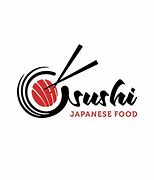
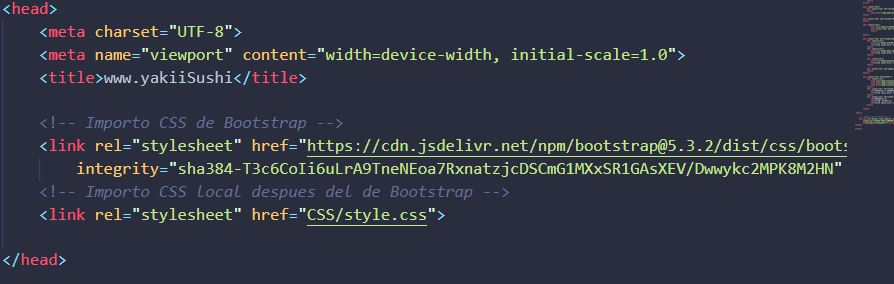
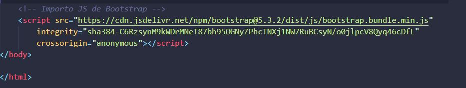

## Restaurante Japanese Food
---
##Contenido
1. Vista principal (Home)
        Bienvenida
        Razón restaurante
        Enfoque
        Platos de la casa
        Contactanos-Reservas-Horarios
2. Carta
        Menú
3. Contacto
        Google map
        Reserva
---        

##Descripción
La funcionalidad de esta aplicación web representa la razón de ser de este restaurante Japanese Food mostrando mediante tres archivos .html con estilo responsive, su carta resaltando los platos de la casa, así como la bienvenida a sus clientes adentrandolos con sus imagenes a la autentica cocina japonesa, los espacios dentro del restaurante acogedores con ambiente representativo a Japón, también podemos encontra un apartado para contactar y realizar reserva, conocer sus horarios, ubicación y formular sugerencias.

---
##Tecnologías empleadas
En dicha aplicación he incluido Html, Boostrap, css personalizado, Mardown a través de Visual Studio Code.
Haciendo uso de dos archivos, carta.html contacto.html enlazados al index.html. Quedando con la siguiente codificación:

Definición de hojas de estilos vinculadas desde la página oficial de Boostrap para dar formato visible a nuestra pagina web ante los usuarios

Vinculación a Javascritp desde la página oficial de Boostrap

---
##Manual de instalación y deployement
Descarga Visual Studio Code: como framework para html, css, diferentes lenguajes de programación incluyendo javascript
https://code.visualstudio.com/download

---
##Motivación: 
He tomado la idea de desarrollar mi primera página web estatica sobre Japanes Food motivada al gran gusto por la comida japonesa, ademas de aportar esta útil herramienta para dar a conocer a nivel general dicho restaurante.

Aparte del objetivo principal de poder desarrollar dicha página, continuaré agregando más contenido que aporten funcionalidades diferentes, a medida que vaya obteniendo más control sobre las diferentes herramientas a usar para incluir otros archivo.html específicos en pedidos para llevar a casa, tema de carrito de compra, pagos, anulación de servicios, añadir carta de alergénicos, mejoras en el diseño, entre otros puntos.

---
##Licencias: 
se ha utilizado licencia gratuita para todo el desarrollo web.

---
##Agradecimientos: 
En primer lugar agradecer a los compañeros que de alguna forma hacen que el aprendizaje sea más productivo con todas sus participaciones relacionadas a temas relevantes, así como también a nuestros profesores, sin dejar atrás la plataforma slack que forma parte de nuestro día a ida, señalando en gran parte la existencia de las librerías de stack over flow, bootstrap@5, Chat de Bing, vídeos y tutoriales, a todas aquellas herramientas que nos acercan más a entender este maravilloso mundo de la programación.

    

